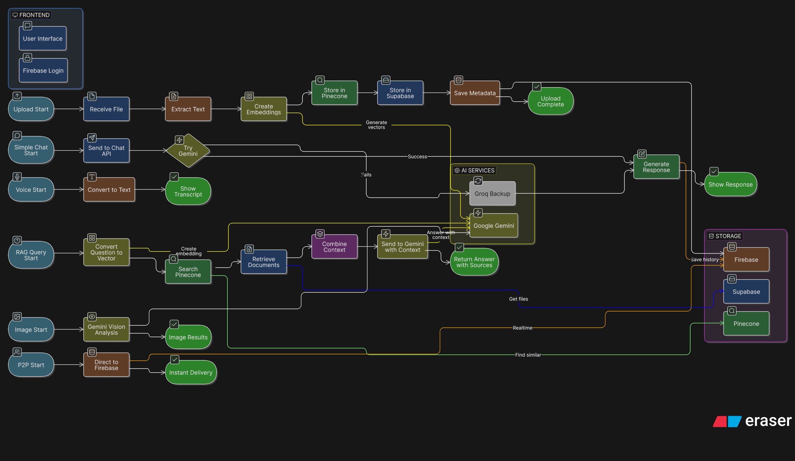

<div align="center">

# 🤖 ChatVerse AI - Core Backend  
**A blazingly fast FastAPI intelligent routing engine for text, voice, and multimodal Gemini & Groq with RAG capabilities.**

 
 


</div>

<br/>

## 🌐 Overview
The **ChatVerse AI Backend** is the powerful middleware orchestrating intelligent AI interactions between the React frontend and multiple LLM providers. Built with **asynchronous Python** using `FastAPI` and powered by **Google Gemini**, **Groq**, and **RAG** technologies, this server handles API key security, dynamic personas, multimodal processing, and vector-based document retrieval.

**Key Mission**: Provide a scalable, secure, and intelligent API layer that supports text chat, voice processing, image analysis, and intelligent document retrieval with fallback mechanisms.

---

## 🏗️ Architecture

<div align="center">



</div>

---

## � Related Repositories

- **Frontend**: [ChatVerse AI Frontend](https://github.com/Rahul-8283/chatverse-ai)

---

## �🛠️ Backend Technology Stack

### **System Architecture Diagram**

```
┌─────────────────────────────────────────────────────────────┐
│                   ChatVerse AI Backend                      │
│                    Architecture Stack                       │
└─────────────────────────────────────────────────────────────┘

┌─────────────────────────────────────────────────────────────┐
│  FRONTEND INTERFACE                                         │
│  (React + TypeScript Frontend)                              │
└────────────────────┬────────────────────────────────────────┘
                     │ HTTP/REST
┌────────────────────▼────────────────────────────────────────┐
│  FASTAPI SERVER (Async Python 3.11)                         │
│  ├─ CORS Middleware                                         │
│  ├─ Authentication (Firebase)                               │
│  └─ Request Routing & Validation                            │
└────────────────────┬────────────────────────────────────────┘
                     │
        ┌────────────┼────────────┐
        │            │            │
   ┌────▼──┐  ┌──────▼──┐  ┌──────▼──┐
   │ GEMINI│  │ GROQ    │  │ RAG     │
   │ 2.5   │  │ LLM     │  │ PIPELINE│
   │ Flash │  │ (Fback) │  │         │
   └────┬──┘  └────┬────┘  └────┬────┘
        │          │            │
        └──────────┼────────────┘
                   │
        ┌──────────┴───────────┬─────────────┐
        │                      │             │
   ┌────▼──────┐      ┌───────▼────┐  ┌───▼──────┐
   │ PINECONE  │      │ SUPABASE   │  │ FIREBASE │
   │ Vector DB │      │ File Store │  │ Auth/DB  │
   │ (Embeddings)     │ (Documents)│  │ (Data)   │
   └───────────┘      └────────────┘  └──────────┘
        │                      │             │
        └──────────────────────┴─────────────┘
                   │
            ┌──────▼──────┐
            │ EXTERNAL    │
            │ SERVICES    │
            ├─ Speech2Text│
            ├─ PDF Parser │
            └─ Embeddings │
            └─────────────┘
```

### **Tech Stack Details**

| Component | Technology | Purpose |
|-----------|-----------|---------|
| **Framework** | FastAPI | High-performance async web framework |
| **Runtime** | Python 3.11 | Server runtime |
| **LLM #1** | Google Gemini 2.5 Flash | Primary AI model with vision capabilities |
| **LLM #2** | Groq API | Fallback LLM for chat operations |
| **Vector DB** | Pinecone | Semantic search & embeddings storage |
| **RAG Engine** | Custom RAG Pipeline | Document-based context retrieval |
| **File Storage** | Supabase (PostgreSQL) | Document metadata & file storage |
| **Authentication** | Firebase Admin SDK | User verification & JWT validation |
| **Audio Processing** | SpeechRecognition | Audio-to-text transcription |
| **PDF Processing** | PyPDF2 + pdfplumber | PDF content extraction |
| **Image Processing** | Pillow | Image manipulation & analysis |
| **HTTP Client** | aiohttp + requests | Async HTTP calls |
| **Embeddings** | Gemini API | Text vectorization for RAG |
| **Deployment** | Render | Cloud hosting platform |

---

## 📁 Project Structure

```
chatverse-ai-backend/
├── main.py                 # FastAPI application & endpoints
├── requirements.txt        # Python dependencies
├── .env                    # Environment variables (not in git)
├── config/
│   ├── config.py          # Configuration loader
│   └── __init__.py
├── auth/
│   ├── firebase_auth.py   # Firebase token verification
│   └── __init__.py
├── services/
│   ├── chat_service.py    # Chat operations
│   ├── rag_service.py     # RAG pipeline
│   ├── document_service.py # Document management
│   ├── data_processor.py  # Content processing
│   ├── embeddings.py      # Vector generation
│   ├── pinecone_handler.py # Vector DB operations
│   ├── supabase_handler.py # File storage operations
│   └── __init__.py
├── test/
│   ├── test_models_google.py
│   ├── test_models_groq.py
│   └── __init__.py
└── README.md              # This file
```

---

## ⚡ Core Features

### **1. Dual LLM Chat with Intelligent Fallback**
- Primary: Google Gemini 2.5 Flash with extended context
- Fallback: Groq API for redundancy
- Dynamic persona support (Assistant, Therapist, Study Buddy, Roast Bot)

### **2. Retrieval-Augmented Generation (RAG)**
- Upload documents (PDF, images, audio)
- Automatic embedding generation
- Semantic search using Pinecone vector database
- Context-aware responses based on document content

### **3. Multimodal Processing**
- **Image Analysis**: Upload images for Gemini vision analysis
- **Voice Transcription**: Real-time audio-to-text conversion from `.webm` files
- **Multipart Payload Handling**: Native binary file processing

### **4. Document Management**
- Upload and store documents securely
- Retrieve document embeddings from Pinecone
- Delete documents with cascading cleanup
- User-specific document isolation

### **5. Conversation Management**
- Chat history storage in Firestore
- Delete specific conversations
- Clean history of interactions

### **6. Firebase Integration**
- Secure token-based authentication
- User session management
- Data persistence in Firestore

---

## 📡 API Endpoints

### **Health & System**
| Method | Endpoint | Description |
|--------|----------|-------------|
| `GET` | `/health` | Server health check |

---

### **Chat Endpoints**

#### 1. **Standard Chat with Fallback**
```
POST /api/chat
```
**Purpose**: Direct chat with LLM (Gemini → Groq fallback)  
**Authentication**: No  
**Request Body**:
```json
{
  "message": "Your message here",
  "history": [
    {"sender": "user", "text": "Previous user message"},
    {"sender": "assistant", "text": "Previous AI response"}
  ],
  "persona": "Assistant"
}
```
**Response**:
```json
{
  "response": "AI generated response text"
}
```

#### 2. **RAG-Powered Chat**
```
POST /api/rag-chat
```
**Purpose**: Query with document context retrieval  
**Authentication**: Firebase Token Required ✅  
**Request Body**:
```json
{
  "query": "What is mentioned about topic X in my documents?"
}
```
**Response**:
```json
{
  "response": "Context-aware response from RAG pipeline",
  "sources": [
    {
      "document_id": "doc_123",
      "filename": "document.pdf",
      "relevance": 0.95
    }
  ]
}
```

### **Document Management Endpoints**

#### 3. **Upload Document**
```
POST /api/upload-document
```
**Purpose**: Upload document for RAG indexing  
**Authentication**: Firebase Token Required ✅  
**Content-Type**: `multipart/form-data`  
**Request Parameters**:
- `file` (File): PDF, image, or audio file
- Auto-extracted: `user_id` from Firebase token  

**Response**:
```json
{
  "success": true,
  "filename": "document.pdf",
  "message": "File is being processed. It will be available for queries shortly."
}
```

#### 4. **Get User Documents**
```
GET /api/documents
```
**Purpose**: Retrieve all documents uploaded by user  
**Authentication**: Firebase Token Required ✅  

**Response**:
```json
{
  "documents": [
    {
      "doc_id": "doc_123",
      "filename": "research.pdf",
      "upload_date": "2024-01-15T10:30:00Z",
      "file_size": 2048576,
      "status": "processed"
    }
  ]
}
```

#### 5. **Delete Specific Document**
```
DELETE /api/documents/{doc_id}
```
**Purpose**: Delete single document from all storage systems  
**Authentication**: Firebase Token Required ✅  
**Path Parameters**:
- `doc_id`: Document identifier  

**Response**:
```json
{
  "success": true,
  "message": "Document deleted successfully"
}
```

#### 6. **Delete All Documents**
```
DELETE /api/documents/delete-all
```
**Purpose**: Clear all documents for authenticated user  
**Authentication**: Firebase Token Required ✅  

**Response**:
```json
{
  "success": true,
  "message": "All documents deleted successfully"
}
```

### **Image & Vision Endpoints**

#### 7. **Image Analysis**
```
POST /api/image-scan
```
**Purpose**: Analyze image with Gemini Vision  
**Authentication**: No  
**Content-Type**: `multipart/form-data`  
**Request Parameters**:
- `file` (File): Image file (.jpg, .png, etc.)
- `prompt` (string): Analysis prompt

**Response**:
```json
{
  "response": "Detailed image analysis from Gemini"
}
```

### **Audio Processing Endpoints**

#### 8. **Voice Transcription**
```
POST /api/voice
```
**Purpose**: Convert audio to text  
**Authentication**: No  
**Content-Type**: `multipart/form-data`  
**Request Parameters**:
- `file` (File): Audio file (.webm, .mp3, .wav, etc.)

**Response**:
```json
{
  "success": true,
  "transcript": "Transcribed text from audio",
  "filename": "recording.webm"
}
```

### **Conversation Management Endpoints**

#### 9. **Delete Chat Conversation**
```
DELETE /api/chat/{conversation_id}
```
**Purpose**: Delete specific conversation and all messages  
**Authentication**: Firebase Token Required ✅  
**Path Parameters**:
- `conversation_id`: Chat type (e.g., 'assistant', 'rag-analysis', 'therapist')

**Response**:
```json
{
  "success": true,
  "message": "Chat conversation 'assistant' deleted successfully"
}
```

---

## 📦 Core Services

### **1. RAG Service** (`rag_service.py`)
Handles intelligent document retrieval and context augmentation:
- Query embedding generation
- Semantic similarity search in Pinecone
- Context ranking and selection
- Fallback handling between Gemini and Groq

### **2. Document Service** (`document_service.py`)
Manages document lifecycle:
- Upload processing
- Storage in Supabase
- Metadata in Firestore
- Cascade deletion across systems

### **3. Chat Service** (`chat_service.py`)
Conversation management:
- Message persistence
- History retrieval
- Conversation deletion
- User session tracking

### **4. Data Processor** (`data_processor.py`)
Multimodal content processing:
- PDF text extraction
- Image preprocessing
- Audio transcription
- Data normalization

### **5. Embeddings** (`embeddings.py`)
Vector generation:
- Gemini-powered text embeddings
- Chunk-based processing
- Embedding caching

### **6. Pinecone Handler** (`pinecone_handler.py`)
Vector database operations:
- Embedding storage
- Semantic search
- Vector deletion

### **7. Supabase Handler** (`supabase_handler.py`)
File and data storage:
- Document file upload
- Metadata persistence
- File retrieval

---

## 🚀 Setup & Installation

### **Prerequisites**
- Python 3.11+
- pip package manager
- Git

### **Step 1: Clone Repository**
```bash
git clone https://github.com/Rahul-8283/chatverse-ai-backend.git
cd chatverse-ai-backend
```

### **Step 2: Create Virtual Environment**
```bash
# Windows
python -m venv venv
venv\Scripts\activate

# macOS/Linux
python3 -m venv venv
source venv/bin/activate
```

### **Step 3: Install Dependencies**
```bash
pip install -r requirements.txt
```

### **Step 4: Configure Environment Variables**
Create a `.env` file in the root directory:
```dotenv
GEMINI_API_KEY=your_gemini_api_key
GROQ_API_KEY=your_groq_api_key

PINECONE_INDEX_NAME=your_pinecone_index_name
PINECONE_API_KEY=your_pinecone_api_key

SUPABASE_URL=your_supabase_url
SUPABASE_BUCKET=your_supabase_bucket_name
SUPABASE_SECRET_KEY=your_supabase_secret_key

FIREBASE_PROJECT_ID=project_id
FIREBASE_CLIENT_ID=your_firebase_client_id
FIREBASE_CLIENT_EMAIL=your_firebase_client_email
FIREBASE_PRIVATE_KEY=your_firebase_private_key
FIREBASE_PRIVATE_KEY_ID=your_firebase_private_key_id
```

### **Step 5: Download Firebase Credentials**
1. Go to [Firebase Console](https://console.firebase.google.com/)
2. Navigate to Project Settings → Service Accounts
3. Click "Generate New Private Key"
4. Save as `firebase-service-account-key.json` in project root

### **Step 6: Run Development Server**
```bash
uvicorn main:app --reload --host 0.0.0.0 --port 8000
```

**Access API Documentation**:
- Swagger UI: http://localhost:8000/docs
- ReDoc: http://localhost:8000/redoc

---

## 📦 Dependencies Overview

```
Core Framework:
  ├─ FastAPI (Web framework)
  ├─ Uvicorn (ASGI server)
  └─ Python-multipart (Form data parsing)

AI/ML:
  ├─ google-generativeai (Gemini API)
  ├─ groq (Groq LLM API)
  ├─ pinecone-client (Vector DB)
  └─ numpy (Numerical computing)

Data Processing:
  ├─ PyPDF2 (PDF reading)
  ├─ pdfplumber (PDF extraction)
  ├─ Pillow (Image processing)
  └─ pandas (Data manipulation)

Cloud Services:
  ├─ firebase-admin (Firebase integration)
  ├─ supabase (Backend as a Service)
  └─ requests (HTTP client)

Audio:
  └─ SpeechRecognition (Audio transcription)
```

---

## 📄 License

This project is licensed under the MIT License. See [LICENSE](./LICENSE) file for details.

---